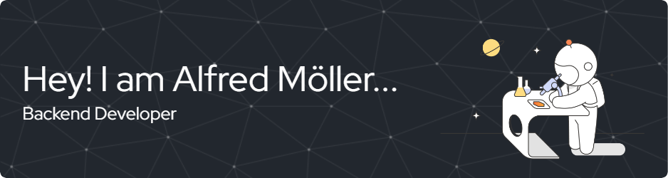

-  👋 Hi, I’m @AlfredMoller
- 👀 I’m interested in new programming languages, methods like computer vision, Machine Learning
- 🌱 I’m currently learning and experimenting with FastAPI, robotics, and backend architectures. I’m also exploring the possibility of migrating a computer vision process to YOLO (Ultralytics)
- 🥰 I'm a big Lego fan
- 💼 I’m a Python developer with Odoo, with almost 4 years of experience building custom modules, business logic, and integrations.
      I’ve worked with Odoo extensively, especially in complex business processes, although I enjoy exploring other technologies and paradigms beyond ERP systems.
- 💞️ I’m looking to collaborate on new projects like python, Java Web...
- 💯 Currently, I’m developing Agrobot as a personal hobby project, exploring the integration of Odoo, robotics, and computer vision applied to agriculture
- 📫 You can reach at this e-mail direction: almoller623@gmail.com ...

<!---
AlfredMoller/AlfredMoller is a ✨ special ✨ repository because its `README.md` (this file) appears on your GitHub profile.
You can click the Preview link to take a look at your changes.
--->

 <!---->

