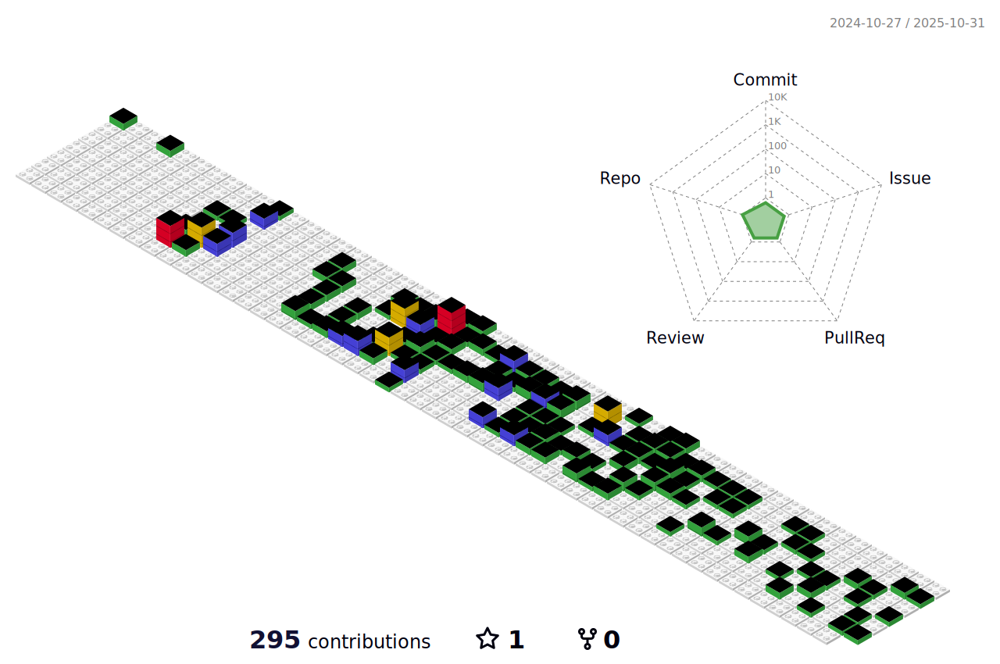

-  👋 Hi, I’m @AlfredMoller
- 👀 I’m interested in new programming languages, methods like computer vision, Machine Learning
- 🌱 I’m currently learning Nodejs, React and Django as hobby...
- 🥰 I'm a big Lego fan
- 💼 I currently work as a Python developer with Odoo (1 year and 9 months)... And I am not such a fan of technology compared to others.
- 💞️ I’m looking to collaborate on new projects like python, Java Web...
- 📫 You can reach at this e-mail direction: almoller622@gmail.com ...

<!---
AlfredMoller/AlfredMoller is a ✨ special ✨ repository because its `README.md` (this file) appears on your GitHub profile.
You can click the Preview link to take a look at your changes.
--->

 <!---->

